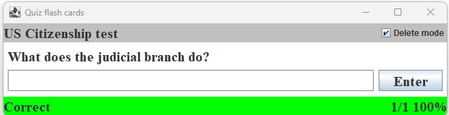

# Quiz - learning tools 

Java question/answer based learning tools in quiz program style. Available in two formats:

1. _[Quiz](./quiz)_ - simple Java Swing quiz program to help with memorization - loads a text-based question/answer file covering any subject

   

2. _[Quiz-AI](./quiz-ai)_ - Includes an Azure OpenAI Info button for ehnanced learning

   